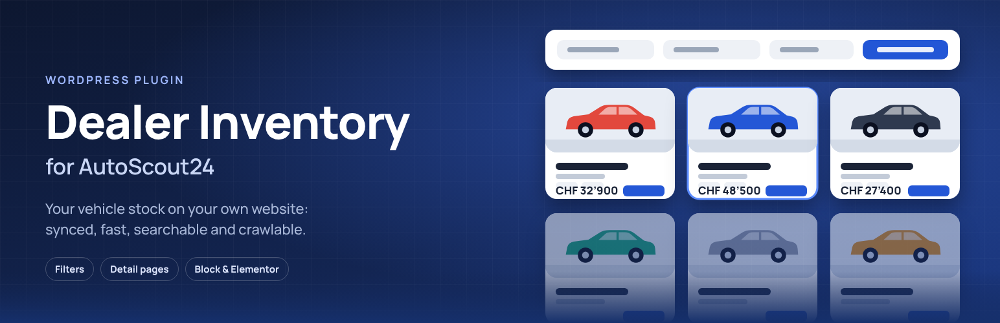

<p align="center">
  
</p>

# Dealer Inventory for AutoScout24

Show your AutoScout24 vehicle stock on your own WordPress site. The listings are synced into your WordPress database on a schedule. Visitors browse a fast, server-rendered list that search engines can crawl, and their page views never call the AutoScout24 API.

[](https://github.com/drilonsaiti/autoscout24-inventory-plugin/actions/workflows/ci.yml)


| Cards with filters | List with sidebar filters | Detail page |
| --- | --- | --- |
|  |  |  |

> **Not affiliated with AutoScout24.** This is an independent open-source plugin. It is not endorsed or sponsored by AutoScout24 or SMG Swiss Marketplace Group. AutoScout24 is a trademark of its owner. Each site uses its own API access, which AutoScout24 issues to the dealer.

## Contents

- [Features](#features)
- [Requirements](#requirements)
- [Installation](#installation)
- [Getting API access](#getting-api-access)
- [Setup](#setup)
- [Adding an inventory to a page](#adding-an-inventory-to-a-page)
- [Detail pages and SEO](#detail-pages-and-seo)
- [Privacy and external services](#privacy-and-external-services)
- [Security](#security)
- [Customizing](#customizing)
- [How it works](#how-it-works)
- [FAQ](#faq)
- [Development](#development)
- [Contributing](#contributing)
- [License](#license)

## Features

- **Sync on a schedule:** from every 15 minutes to every 12 hours, or once a day at a fixed time. There is also **Sync now** and a connection test. Sold cars are hidden automatically.
- **Layouts:** cards, compact grid, list and table, with columns set separately for desktop, tablet and phone. An optional grid/list switch remembers the visitor's choice.
- **Filters:**
  - Make and model as two dropdowns, one combined picker or a searchable field, with live counts.
  - Price, year, mileage, fuel, body type, transmission, drive, power, condition and warranty.
  - Choose the filters and drag them into order. Show them above the results or in a sidebar, as an off-canvas panel on phones. Ranges can be number fields or sliders.
- **Sorting and paging:** newest, price, mileage, year, power or make. Paging uses page numbers, "Load more" or infinite scrolling, always with real, crawlable links. Visitors can choose the page size if you allow it.
- **Cards:** choose which parts to show, plus badges (new, warranty, price reduced), monthly rate, image ratio, a mini-gallery and hover effects.
- **Detail pages on your site** (optional): photo gallery, specifications, equipment, dealer box, SEO title and description, canonical URL, Open Graph tags, schema.org `Car` data and an XML sitemap.
- **Design without code:**
  - Presets (Classic, Minimal, Premium dark, Compact) or "Use theme styles".
  - Colors, radius, spacing and shadows, with a live preview.
  - All presets meet WCAG 2.2 AA contrast.
- **Works in every editor:** a Gutenberg block, an Elementor widget and a shortcode with a visual builder. Every option has a site-wide default, and each inventory can override it.
- **Multilingual:** interface in English, German (DE, AT, CH), French and Italian. Works with WPML, Polylang and TranslatePress. Prices and units are formatted for the visitor's language (`CHF 59’900`, `59.900 €`, PS / ch / CV / kW).
- **Fast:**
  - The list is rendered on the server from the local table.
  - Assets load only on pages with an inventory, and static blocks load no JavaScript.
  - List requests are cacheable by CDNs, and pages cached by a page cache refresh themselves after a sync.
- **Accessible:**
  - Everything works with the keyboard, and result counts are announced to screen readers.
  - The mobile filter panel is a proper dialog, and the make/model search is an ARIA combobox.
  - Without JavaScript, filters and paging still work as normal forms and links.

**Market:** AutoScout24 Switzerland (autoscout24.ch). The plugin has a provider layer, so other markets can be added later.

## Requirements

- WordPress 6.5 or newer
- PHP 8.1 or newer (tested on 8.1 to 8.4)
- API access to AutoScout24 Switzerland: Client ID, Client Secret and your Seller ID
- Optional: Elementor, for the Elementor widget

## Installation

**From a zip.** Download `dealer-inventory-for-autoscout24.zip` from [Releases](https://github.com/drilonsaiti/autoscout24-inventory-plugin/releases), or build it yourself (see [Development](#development)). In WordPress, go to **Plugins → Add New → Upload Plugin**, upload the zip and activate the plugin.

**From source.** Clone the repository into `wp-content/plugins/dealer-inventory-for-autoscout24`. The plugin itself needs no build step and no Composer packages. Composer and npm are only used for the development tools.

## Getting API access

The plugin can't create API credentials. AutoScout24 issues them to dealers on request:

1. Ask your AutoScout24 account manager or AutoScout24 customer service for **API access to your own listings for your website**.
2. You'll receive a **Client ID** and a **Client Secret**.
3. Your **Seller ID** is the number of your dealer account on AutoScout24.

Use the credentials in line with your agreement with AutoScout24. The plugin only reads your own listings and your public dealer profile.

## Setup

1. Go to **Dealer Inventory → Connection** and enter the Client ID, Client Secret and Seller ID. Save, then click **Test connection**.
2. Click **Sync now**, or wait for the first scheduled sync.
3. Optional: set site-wide defaults under **Display** and **Design**, and the schedule under **Synchronization**.

To keep credentials out of the database, define them in `wp-config.php`. The admin fields are then locked:

```php
define( 'DINV_CLIENT_ID', 'your-client-id' );
define( 'DINV_CLIENT_SECRET', 'your-client-secret' );
define( 'DINV_SELLER_ID', 12345 );
```

WordPress runs scheduled tasks when someone visits the site. For exact timing on low-traffic sites, call `wp-cron.php` from a server cron job.

## Adding an inventory to a page

Use any of these:

- the **Vehicle Inventory** block in the block editor;
- the **Vehicle Inventory** widget in Elementor;
- the `[dealer_inventory]` shortcode.

**Help & Shortcode** in the admin has a builder with a live preview that writes the shortcode for you.

```text
[dealer_inventory]

[dealer_inventory layout="list" filter_position="sidebar" make_model_mode="searchable" range_style="slider"]

[dealer_inventory make="bmw" body="suv"]
[dealer_inventory query="make=bmw&price_to=50000"]

[dealer_inventory instance="home" per_page="3" sort="price_desc" show_filters="no" show_sort="no" show_pagination="no" url_state="no"]
```

Common attributes:

| Attribute | Values | Default |
| --- | --- | --- |
| `layout` | `card`, `grid`, `list`, `table` | `card` |
| `columns`, `columns_tablet`, `columns_mobile` | number | `3`, `2`, `1` |
| `per_page` | 1–48 | `12` |
| `pagination` | `numbers`, `load_more`, `infinite` | `numbers` |
| `sort` | `newest`, `oldest`, `price_asc`, `price_desc`, `mileage_asc`, `mileage_desc`, `year_desc`, `year_asc`, `power_desc`, `make_model_asc`, `make_model_desc` | `newest` |
| `show_filters` | `yes` / `no` | `yes` |
| `filters` | comma list: `make,price,year,mileage,fuel,body,transmission,drive,power,condition,warranty` | all |
| `filter_position` | `top`, `sidebar` | `top` |
| `make_model_mode` | `separate`, `combined`, `searchable`, `hidden` | `separate` |
| `range_style` | `inputs`, `slider` | `inputs` |
| `link_to` | `autoscout`, `local` (detail page on your site), `none` | `autoscout` |
| `make`, `model`, `fuel`, `body`, `transmission`, `drive`, `condition`, `price_from` … `power_to`, `query` | Fixed filters for this inventory. Visitors can narrow these filters but not widen them. | — |
| `instance` | A unique key when a page has more than one inventory | auto |

The full list of attributes is under **Help & Shortcode**.

## Detail pages and SEO

To give each vehicle its own page on your site:

1. Set **Display → Vehicle links** to *Detail page on this site*.
2. Each vehicle gets a URL like `/cars/vehicle/12345-bmw-x5-xdrive30d/` on the page that shows the inventory.
3. Choose a page under **Display → Vehicle detail pages**. Vehicles then also appear in the WordPress XML sitemap. Detail URLs on any other page redirect to this one.
4. Optional: turn on **Synchronization → Download descriptions and equipment** to show the full description and equipment list.

Each detail page has:

- the SEO title, meta description and canonical URL (Yoast SEO and Rank Math are supported);
- Open Graph tags;
- schema.org `Car` JSON-LD.

Sold vehicles return a 404. Filtered result pages are marked `noindex`, and paging uses real links.

## Privacy and external services

| Service | When | What is sent |
| --- | --- | --- |
| `api.autoscout24.ch` | During a sync and when you click "Test connection". Visitor page views never call it. | Your Client ID and Client Secret (for an access token), your Seller ID, and the language |
| `images.autoscout24.ch` | When a visitor sees a vehicle photo. The photo is loaded by the visitor's browser. | The visitor's IP address and browser information, as with any embedded image |
| `www.autoscout24.ch` | Only when a visitor clicks a link to a listing or to the dealer profile | — |

The plugin sends no data about visitors to AutoScout24 or to anyone else, and it has no tracking or analytics. It adds suggested text for your privacy policy under **Settings → Privacy**.

## Security

- **Credentials:**
  - The Client Secret and the cached access token are encrypted in the database with AES-256-GCM, using a key derived from your WordPress security salts.
  - The secret is never shown again in the admin and never written to logs.
  - You can keep credentials out of the database entirely with the `wp-config.php` constants.
- **Admin actions:** every action requires the `manage_options` capability and a valid nonce. There are no AJAX endpoints for logged-out users.
- **Public REST API:** the routes under `dinv/v1` are read-only and serve only data that is already public on the page. Every parameter is checked against a whitelist or sanitized. Visitors can't change the stored settings, start a sync or widen the filters an inventory has fixed.
- **Data from AutoScout24 is treated as untrusted:**
  - All fields are sanitized when they're stored and escaped when they're shown.
  - Vehicle descriptions keep only text formatting (paragraphs, lists, bold and italic). Links, images, forms and styles are removed.
  - Photos and links are accepted only from AutoScout24 hosts.
- **Database queries:** all queries are prepared, and sort columns come from a fixed whitelist.

To report a vulnerability, see [SECURITY.md](SECURITY.md). Please don't open a public issue for security problems.

## Customizing

### Templates

Copy any file from `templates/` to `yourtheme/dealer-inventory/` (same sub-folder) and edit it there:

```text
inventory.php            single-vehicle.php
parts/header.php         parts/toolbar.php        parts/filters.php
parts/filter-make.php    parts/filter-range.php   parts/results.php
parts/vehicle-media.php  parts/vehicle-title.php  parts/vehicle-price.php  parts/vehicle-button.php
loop/card.php            loop/grid.php            loop/list.php            loop/table-row.php
```

### Filters

| Hook | Use |
| --- | --- |
| `dinv_inventory_config` | Change the resolved configuration of an inventory |
| `dinv_search_filters` | Change the active search filters |
| `dinv_card_data` | Change a vehicle's view model before it is rendered |
| `dinv_vehicle_badges` | Add or remove badges |
| `dinv_vehicle_url` | Change where a vehicle links to |
| `dinv_detail_data`, `dinv_detail_specs` | Change the detail page view model and specification rows |
| `dinv_vehicle_json_ld` | Change the schema.org data of a detail page |
| `dinv_design_tokens` | Change the CSS custom properties |
| `dinv_template`, `dinv_template_args` | Change the template file or its variables |
| `dinv_format_price` | Format prices yourself |
| `dinv_schema_fields` | Add or change settings |
| `dinv_providers` | Register another marketplace provider |
| `dinv_detail_batch_size` | Number of vehicles whose details are downloaded per sync (default 25) |

### Actions

`dinv_before_inventory`, `dinv_after_inventory`, `dinv_before_detail`, `dinv_after_detail`, `dinv_inventory_synced`.

For example, to purge your page cache after each sync:

```php
add_action( 'dinv_inventory_synced', function () {
	if ( function_exists( 'rocket_clean_domain' ) ) {
		rocket_clean_domain();
	}
} );
```

## How it works

```text
AutoScout24 API ──(WP-Cron sync)──▶ wp_dinv_vehicles ──▶ block / widget / shortcode (server-rendered)
                                                     └──▶ REST dinv/v1/vehicles (filter, sort, page; cacheable per sync version)
```

| Path | What it does |
| --- | --- |
| `includes/class-schema.php` | Defines every setting once: type, default, allowed values and scope. The admin screens, shortcode attributes, block, Elementor widget and builder are all generated from it. Precedence: inventory attribute, then site-wide setting, then default. |
| `includes/class-inventory.php` | Combines an inventory's configuration with the visitor's request. Shortcodes and REST requests both use it, so they produce the same markup. |
| `includes/class-sync.php`, `includes/providers/` | The sync (with a lock, so two runs never overlap) and the marketplace API clients (the `Provider` interface and `AutoScout24_CH`). |
| `includes/class-repository.php` | The local vehicles table, search, facets and the public cache. |
| `includes/class-detail.php` | Detail pages: rewrite endpoint, SEO tags, JSON-LD and the sitemap provider. |
| `public/js/inventory.js` | Dependency-free progressive enhancement. |

Schema changes are applied by versioned, repeatable migrations (`includes/class-migrations.php`).

## FAQ

**Does every page view call AutoScout24?**
No. Visitors only read the local copy. Only the photos come from the AutoScout24 image server.

**Does it work with page caching and CDNs?**
Yes. If a cached page is older than the latest sync, the list refreshes itself in the background.

**Will Germany, Austria or Italy be supported?**
Those markets use a different AutoScout24 API. The plugin is prepared for more markets, but support depends on access to those APIs.

**What happens when I delete the plugin?**
By default, the settings, vehicles and logs are kept. Set **Synchronization → When the plugin is deleted** to *Remove everything* before deleting to remove them. Scheduled events and caches are always removed.

There are more questions in [`readme.txt`](readme.txt).

## Development

Files listed in [`.distignore`](.distignore) are not part of the plugin zip.

```bash
composer install       # WPCS, PHPCompatibilityWP, PHPUnit, wp-phpunit
npm ci                 # jsdom for the JavaScript smoke test

composer lint          # phpcs (WordPress standard + PHP 8.1+ compatibility)
composer test          # PHPUnit (needs a test database, see below)
npm run test:js        # filter UI smoke test (node:test + jsdom)
```

PHPUnit needs a WordPress test database. Point `WP_PHPUNIT__TESTS_CONFIG` to a `wp-tests-config.php`. `.github/workflows/ci.yml` has an example. The test suites cover:

- the repository (search, filters, sorting, facets, sync bookkeeping);
- settings sanitizing and precedence;
- migrations;
- shortcode and request parsing, and rendering;
- the REST endpoints;
- detail pages and JSON-LD;
- WCAG contrast of the design presets;
- uninstall.

The JavaScript fixtures in `tests/js/fixtures/` are generated from the real templates. To regenerate them, run `wp eval-file tests/js/build-fixtures.php` on a site with vehicles.

CI (GitHub Actions) runs these jobs:

- phpcs;
- PHPUnit on PHP 8.1–8.4 with the latest WordPress, and on PHP 8.1 with WordPress 6.5 (MySQL 8);
- the JavaScript smoke test;
- [Plugin Check](https://wordpress.org/plugins/plugin-check/) on the built plugin.

To build the plugin zip:

```bash
mkdir -p build/dealer-inventory-for-autoscout24
rsync -a --exclude-from=.distignore ./ build/dealer-inventory-for-autoscout24/
(cd build && zip -r dealer-inventory-for-autoscout24.zip dealer-inventory-for-autoscout24)
```

## Contributing

Issues and pull requests are welcome. Before you open a pull request:

1. Run `composer lint`, `composer test` and `npm run test:js`.
2. Add a test for new behavior or a fixed bug.
3. Keep all user-facing text translatable with the text domain `dealer-inventory-for-autoscout24`.

Release notes are in [CHANGELOG.md](CHANGELOG.md).

## License

[GPL-2.0-or-later](https://www.gnu.org/licenses/gpl-2.0.html).

The plugin is not affiliated with, endorsed by or sponsored by AutoScout24 or SMG Swiss Marketplace Group. AutoScout24 is a trademark of its owner.
